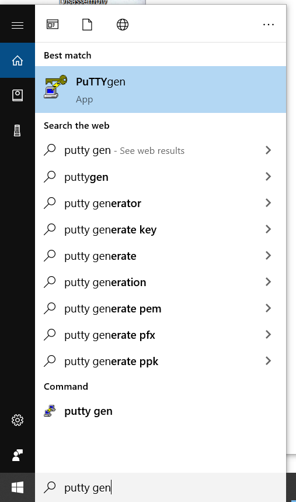
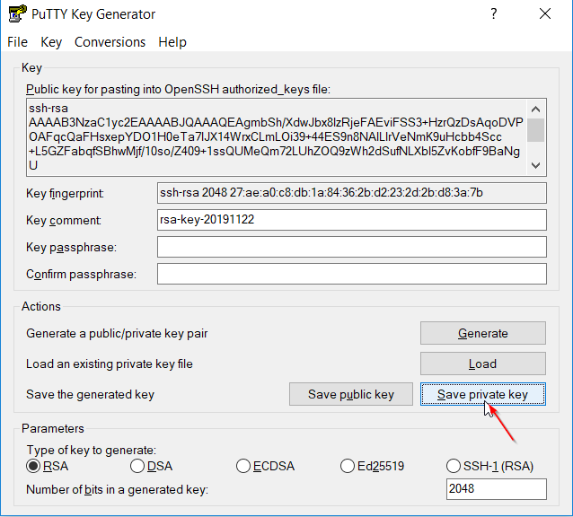
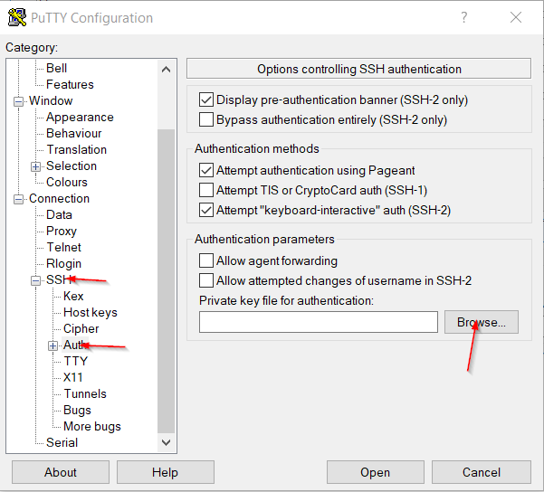
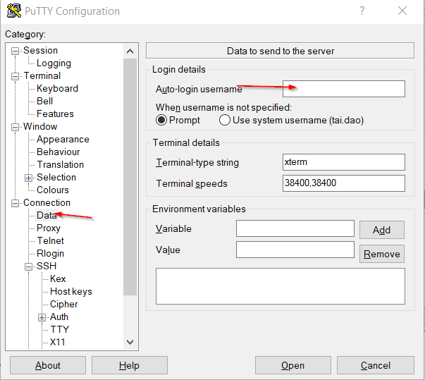
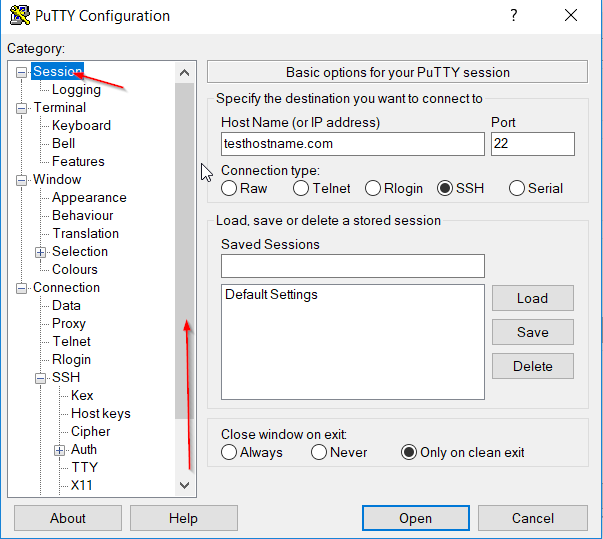
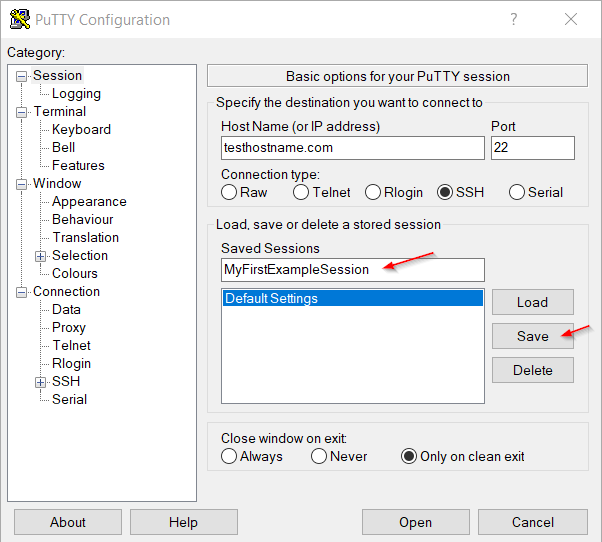
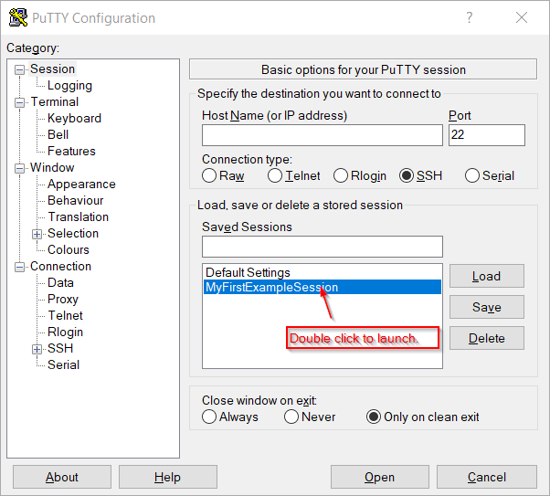

This guide was written for Windows Users using PuTTY

In order to setup SSH access to a linux machine by keys you need to paste in the public key on the linux machine in a file located in /home/yourusername/.ssh/authorized_keys 

To get that public key you need to generate a private key first.

## 1.0 Best Practices
Only use one private key per local physical machine. Public key however can be given away to as many remote Linux machines you want. For example. if you have a Desktop and a Laptop. They both should have their own private keys. However their public keys should be on each of the Linux machines you want to access.

## 1.1 Generating Public Private Key Pair
1. Download putty somewhere on the Internet and install it. Personally I use ninite.com, check PuTTY, download, then run the installer.

2. After putty is installed search for PutTTYgen in Windows and run it.

3. Select Key > SSH-2 RSA-key.

4. Then click “Generate”. Once you do it will ask you to make random mouse movements to help it make it extra random.

5. Then copy the public key as shown in the below picture.

6. On your remote servers. Navigate to /home/yourusername/.ssh (if the .ssh folder doesn't exist create it). Then create a file called authorized_keys, edit it, and paste the public key from step 5 and save.

7. Now click “Save private key” and save it somewhere on your computer. In my example I keep mine in C:\Keys\ but you can save it anywhere you want.

## 1.2 Connecting to a Remote Server with private key on PuTTY

1. Launch PuTTY. Type in the Hostname or IP Address of the server you want to connect to. As for the port you can usually leave it as the default 22 unless specified otherwise by your administrator.

2. After that expand SSH and select Auth as shown in the picture below. Then browse and find the privatekey you saved earlier in step 7 in the previous section above.

3. (Optional) Now select Data on the left side as shown below.

4.(Optional) Here you may enter in the username you will be using to login. This step is entirely optional as you can manually enter in your username when PuTTY prompts you to instead.

5. Now scroll up and go back to “Session” on the navigation.

6. Finally we are going to store the session on PuTTY. Just type in a name for your session then click Save.

7. Once it is saved you can just double click on the saved session to launch it.

## 1.3 Forgot public key
If you need to get your public key from your private .ppk key. Launch PuttyGen. After that click on “Load”. Then browse and choose your private .ppk key. After that your public key should appear under the Key box.

## 2.0 Optional: Keepass + KeeAgent for Window
The fastest and secure way to quickly SSH to every single one of your remote instances.
How to setup KeeAgent + Keepass at 24m25s: https://www.youtube.com/watch?v=e6G8zHZlhv8&t=24m25s
