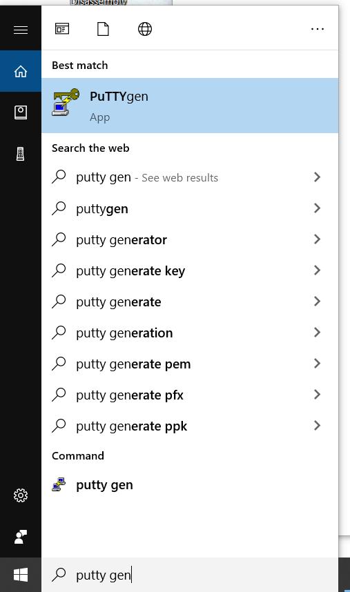
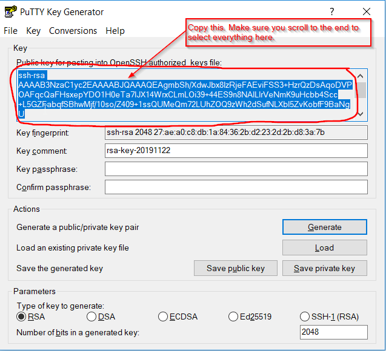
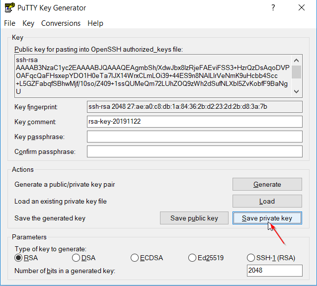

This guide was written for Windows Users using PuTTY

In order to setup SSH access to a linux machine by keys you need to paste in the public key on the linux machine in a file located in /home/yourusername/.ssh/authorized_keys 

To get that public key you need to generate a private key first.

## 1.0 Best Practices
Only use one private key per local physical machine. Public key however can be given away to as many remote Linux machines you want. For example. if you have a Desktop and a Laptop. They both should have their own private keys. However their public keys should be on each of the Linux machines you want to access.

## 1.1 Generating Public Private Key Pair
1. Download putty somewhere on the Internet and install it. Personally I use ninite.com, check PuTTY, download, then run the installer.

2. After putty is installed search for PutTTYgen in Windows and run it.

3. Select Key > SSH-2 RSA-key.

4. Then click “Generate”. Once you do it will ask you to make random mouse movements to help it make it extra random.

5. Then copy the public key as shown in the below picture.

6. On your remote servers. Navigate to /home/yourusername/.ssh (if the .ssh folder doesn't exist create it). Then create a file called authorized_keys, edit it, and paste the public key from step 5 and save.

7. Now click “Save private key” and save it somewhere on your computer. In my example I keep mine in C:\Keys\ but you can save it anywhere you want.

